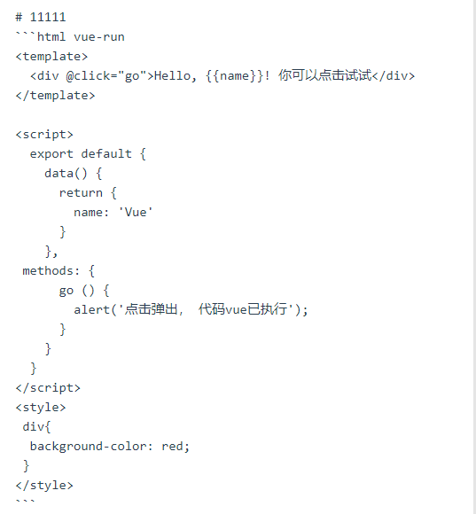
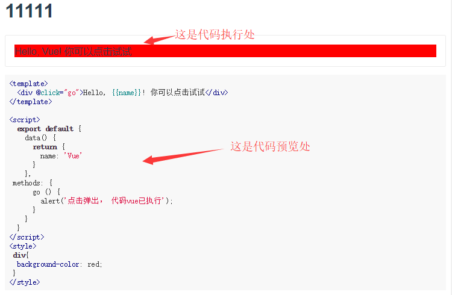

# vue-markdown-run markdown Vue文档自执行

> 一个vue组件，用于markdown 文档中Vue代码执行，可以边看边执行。

### DEMO

https://zhangkunusergit.github.io/vue-markdown-run/dist

### 安装

``` bash
npm install vue-markdown-run --save
```

### 用法

```html
 <markdown-run
    :mark="markdownTxt"
    highlight-style-file-name="github"
    :runClass=""
    :runStyle=""
    @error=""
  />
```
### 参数说明

| 参数 | 值 | 默认值 | 说明 |
| ------ | ------ | ------ | ------ |
| :mark | 必传(String) | 无 | markdown文本字符串(具体要求请看下面的“markdownTxt 写法要求”) |
| :scope | 非(Object) | 无 | markdown文本中，引入的组件，如果不想全局引入，可以局部引入，用法请看上面的DEMO|
| highlight-style-file-name | 非(String) | 'github' | markdown代码部分样式文件名，此处是指定引入那种样式（css）文件 详细请参考：https://highlightjs.org/static/demo/ 中Styles |
| :runClass | 非(String) | 无 | Vue运行代码处的css样式名称 |
| :runStyle | 非(Object) | 无 | Vue运行代码处的行间样式名称 |
| @error | 非(Function) | 无 | 当前组件执行失败的回调函数 |

### markdownTxt 写法要求
代码中必须指定哪个组件是需要执行的，在上面写上*vue-run*, 否则认为是普通文本，不予执行。
vue-run 放在语言类型后面，需要空格，例如：

```html
```html vue-run
<template>
  <div @click="go">Hello, {{name}}! 你可以点击试试</div>
</template>

<script>
  export default {
    data() {
      return {
        name: 'Vue'
      }
    },
 methods: {
      go () {
        alert('点击弹出， 代码vue已执行');
      }
    }
  }
</script>
<style>
 div{
  background-color: red;
 }
</style>
```

### 静态DEMO
markdown 文本



vue-markdown-run 执行后



### 如有问题请联系
###### 邮箱： 1766597067@qq.com
###### 微信号： 18625531739
